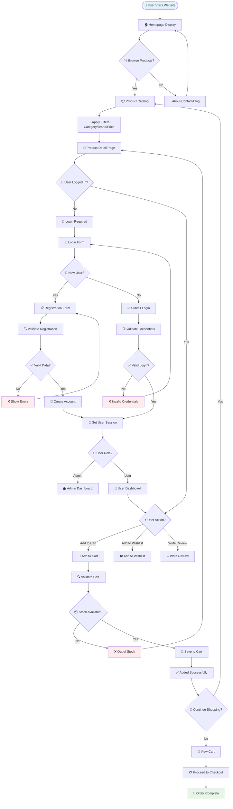
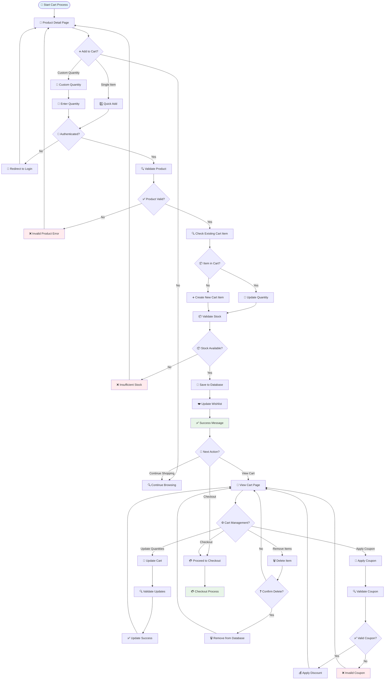
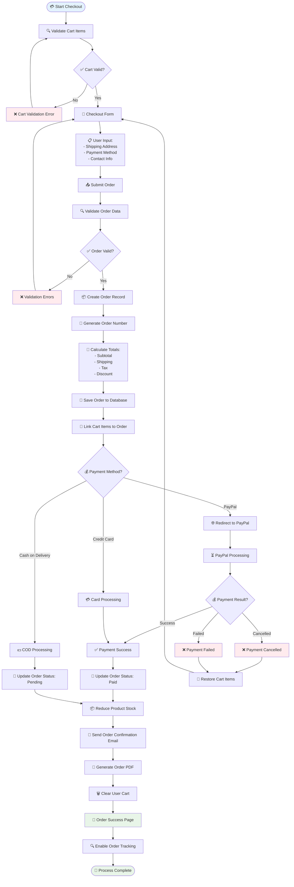
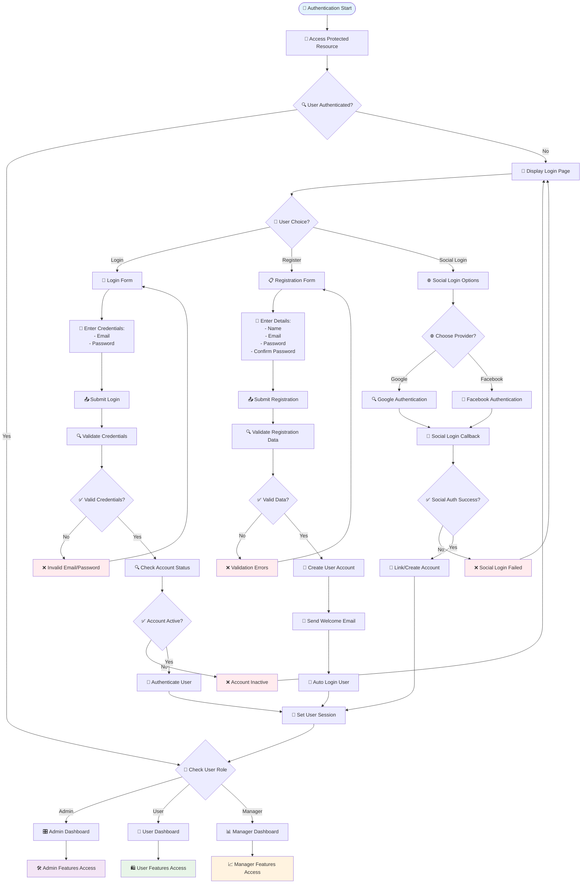
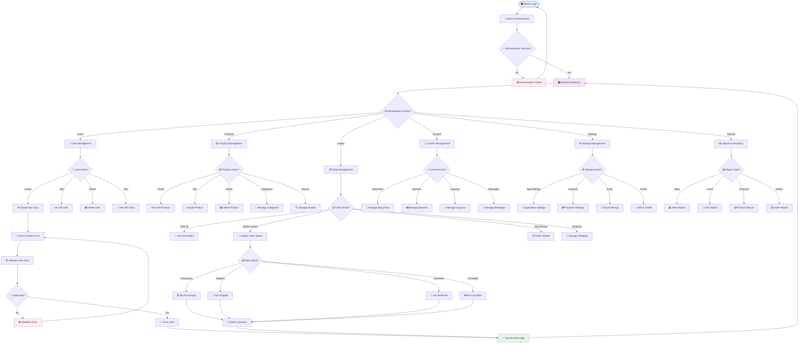
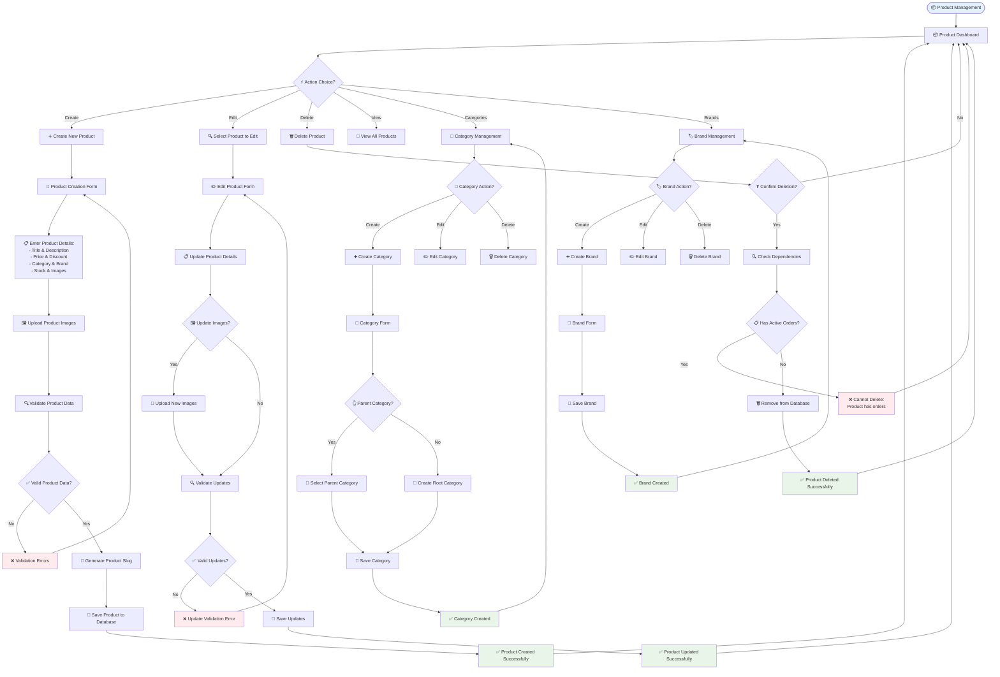
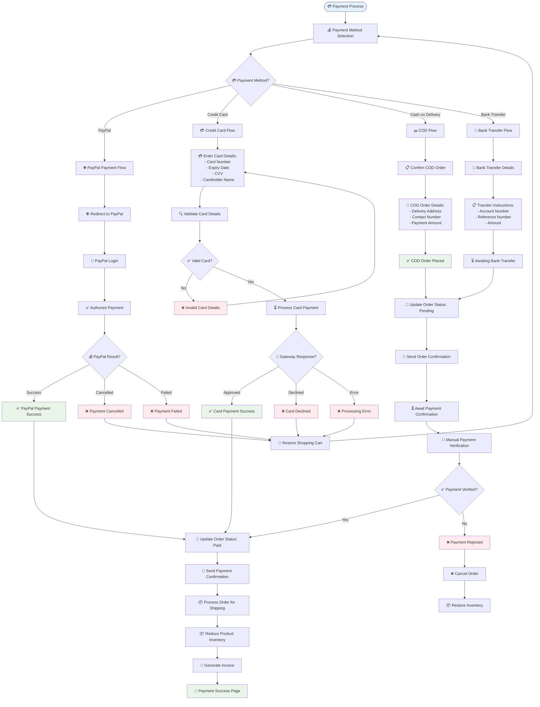

# E-Commerce Laravel Application - Flowchart Diagrams

## Table of Contents
1. [Main User Journey Flowchart](#main-user-journey-flowchart)
2. [Shopping Cart Process Flowchart](#shopping-cart-process-flowchart)
3. [Order Processing Flowchart](#order-processing-flowchart)
4. [User Authentication Flowchart](#user-authentication-flowchart)
5. [Admin Management Flowchart](#admin-management-flowchart)
6. [Product Management Flowchart](#product-management-flowchart)
7. [Payment Processing Flowchart](#payment-processing-flowchart)

---

## Main User Journey Flowchart

---

## Shopping Cart Process Flowchart

---

## Order Processing Flowchart

---

## User Authentication Flowchart

---

## Admin Management Flowchart

---

## Product Management Flowchart

---

## Payment Processing Flowchart

---

## Legend

### Flowchart Symbols Used:
- 🏁 **Oval**: Start/End points
- 📝 **Rectangle**: Process/Action steps
- 💎 **Diamond**: Decision points
- 📋 **Parallelogram**: Input/Output operations
- 🔄 **Circle**: Connectors/References
- ➡️ **Arrow**: Flow direction

### Color Coding:
- 🔵 **Blue**: Start points and information
- 🟢 **Green**: Success states and completion
- 🔴 **Red**: Error states and failures
- 🟡 **Yellow**: Warning or pending states
- 🟣 **Purple**: Admin-specific processes

---

These comprehensive flowchart diagrams provide a complete visual representation of all major processes in your Laravel e-commerce application, using proper flowchart symbols and clear decision paths.