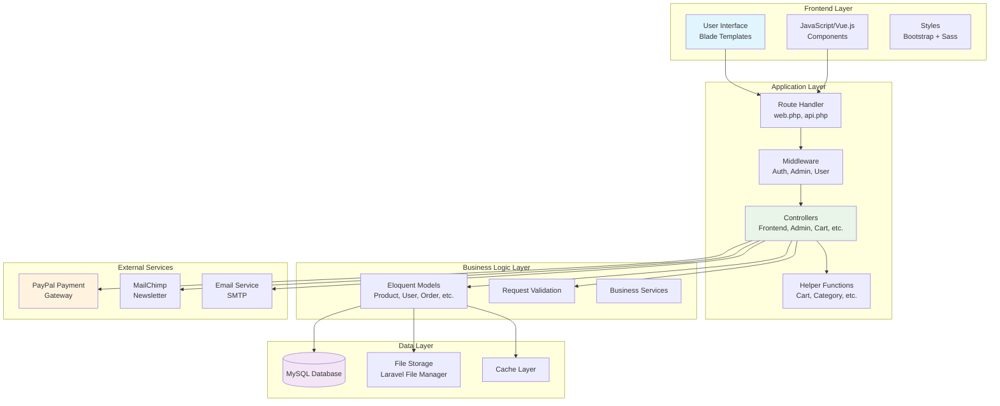
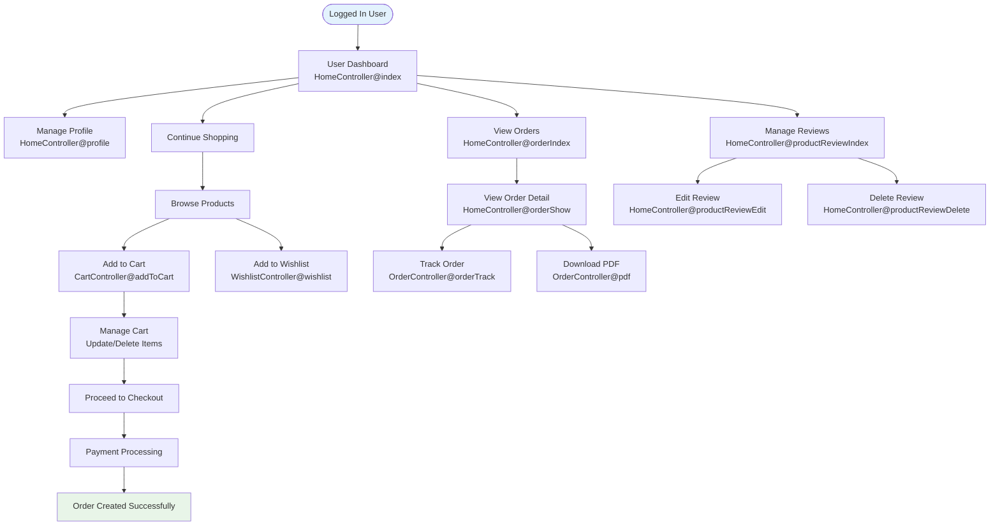
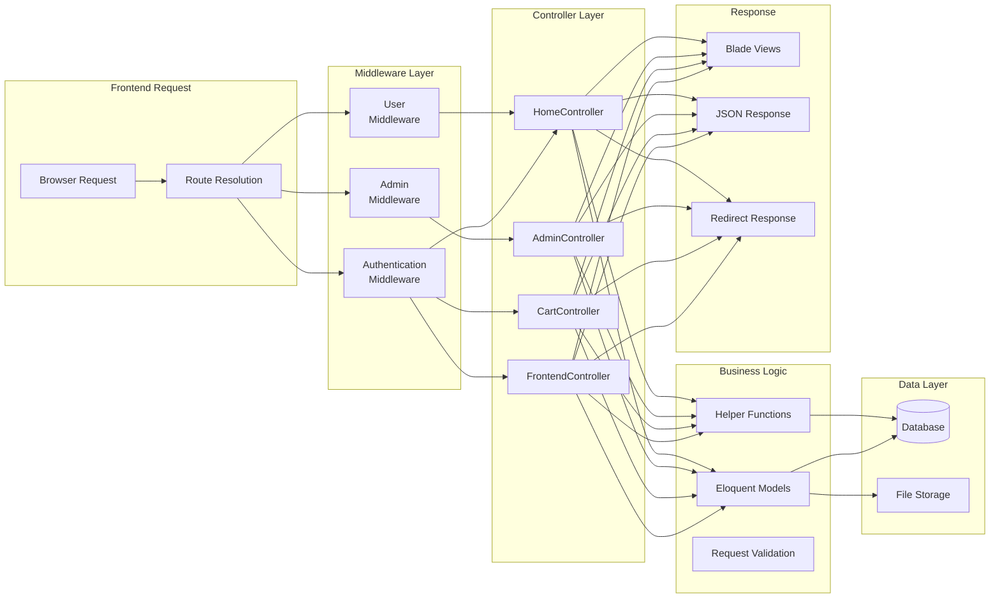
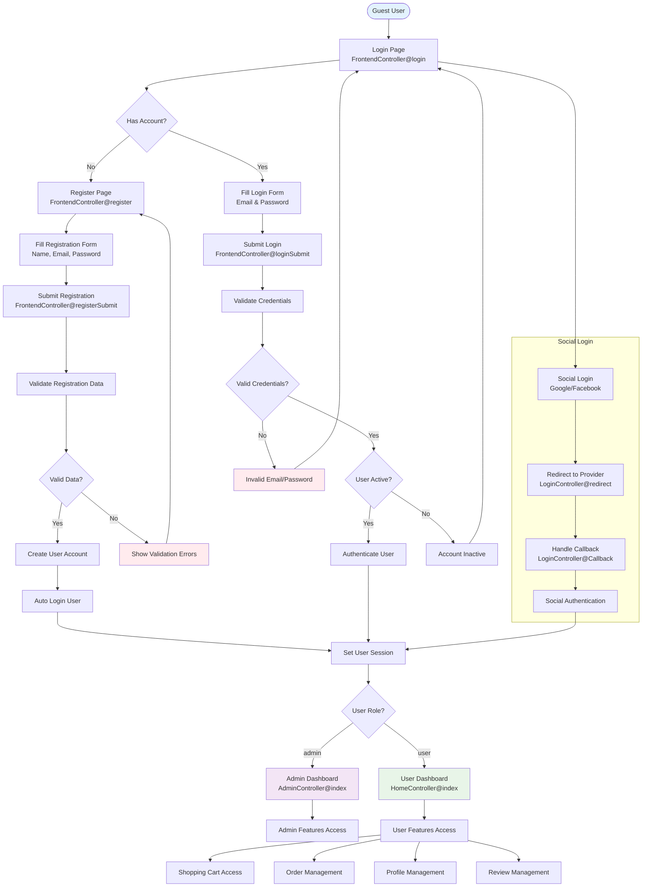
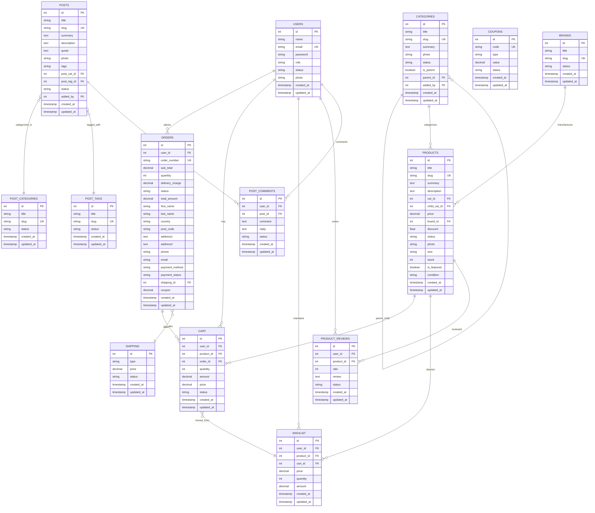

# E-Commerce Laravel Application - Flow Diagrams

## Table of Contents
1. [System Architecture Overview](#system-architecture-overview)
2. [User Journey Flows](#user-journey-flows)
3. [Admin Workflow](#admin-workflow)
4. [Data Flow Architecture](#data-flow-architecture)
5. [Shopping Cart Flow](#shopping-cart-flow)
6. [Order Processing Flow](#order-processing-flow)
7. [Authentication Flow](#authentication-flow)
8. [API Request Flow](#api-request-flow)
9. [Database Relationships](#database-relationships)
10. [Component Interaction Diagram](#component-interaction-diagram)

---

## System Architecture Overview



---

## User Journey Flows

### Guest User Flow
```mermaid
graph TD
    Start([Guest Visitor]) --> Home[Homepage<br/>FrontendController@home]
    Home --> Browse{Browse Products?}
    
    Browse -->|Yes| ProductGrid[Product Grid/List<br/>FrontendController@productGrids]
    Browse -->|No| Blog[Blog Section<br/>FrontendController@blog]
    Browse -->|No| About[About/Contact Pages]
    
    ProductGrid --> Filter[Apply Filters<br/>Category, Brand, Price]
    Filter --> ProductDetail[Product Detail<br/>FrontendController@productDetail]
    
    ProductDetail --> Auth{User Logged In?}
    Auth -->|No| Login[Login Page<br/>FrontendController@login]
    Auth -->|Yes| AddCart[Add to Cart<br/>CartController@addToCart]
    
    Login --> Register{New User?}
    Register -->|Yes| SignUp[Register<br/>FrontendController@register]
    Register -->|No| LoginSubmit[Login Submit<br/>FrontendController@loginSubmit]
    
    SignUp --> UserDash[User Dashboard]
    LoginSubmit --> UserDash
    AddCart --> Cart[Shopping Cart<br/>View Cart Items]
    
    Cart --> Checkout[Checkout Process<br/>CartController@checkout]
    Checkout --> Payment[Payment Gateway<br/>PayPal Integration]
    Payment --> OrderComplete[Order Confirmation]
    
    style Start fill:#e3f2fd
    style OrderComplete fill:#e8f5e8
    style Payment fill:#fff3e0
```

### Registered User Flow


---

## Admin Workflow

```mermaid
graph TD
    AdminLogin([Admin Login]) --> AdminDash[Admin Dashboard<br/>AdminController@index]
    
    AdminDash --> UserMgmt[User Management<br/>UsersController]
    AdminDash --> ProductMgmt[Product Management<br/>ProductController]
    AdminDash --> OrderMgmt[Order Management<br/>OrderController]
    AdminDash --> ContentMgmt[Content Management]
    AdminDash --> Settings[System Settings<br/>AdminController@settings]
    
    UserMgmt --> CreateUser[Create User]
    UserMgmt --> EditUser[Edit User]
    UserMgmt --> DeleteUser[Delete User]
    UserMgmt --> ViewUsers[View All Users]
    
    ProductMgmt --> CreateProduct[Create Product<br/>ProductController@create]
    ProductMgmt --> EditProduct[Edit Product<br/>ProductController@edit]
    ProductMgmt --> DeleteProduct[Delete Product<br/>ProductController@destroy]
    ProductMgmt --> ManageCategories[Manage Categories<br/>CategoryController]
    ProductMgmt --> ManageBrands[Manage Brands<br/>BrandController]
    
    OrderMgmt --> ViewAllOrders[View All Orders<br/>OrderController@index]
    OrderMgmt --> UpdateOrderStatus[Update Order Status<br/>OrderController@update]
    OrderMgmt --> ViewOrderDetail[View Order Details<br/>OrderController@show]
    OrderMgmt --> ManageShipping[Manage Shipping<br/>ShippingController]
    
    ContentMgmt --> BlogMgmt[Blog Management<br/>PostController]
    ContentMgmt --> BannerMgmt[Banner Management<br/>BannerController]
    ContentMgmt --> CouponMgmt[Coupon Management<br/>CouponController]
    ContentMgmt --> MessageMgmt[Message Management<br/>MessageController]
    
    BlogMgmt --> CreatePost[Create Post]
    BlogMgmt --> ManageCategories2[Manage Post Categories<br/>PostCategoryController]
    BlogMgmt --> ManageTags[Manage Post Tags<br/>PostTagController]
    BlogMgmt --> ManageComments[Manage Comments<br/>PostCommentController]
    
    Settings --> ProfileSettings[Profile Settings<br/>AdminController@profile]
    Settings --> AppSettings[Application Settings<br/>AdminController@settingsUpdate]
    Settings --> PasswordChange[Change Password<br/>AdminController@changePassword]
    
    style AdminLogin fill:#ffebee
    style AdminDash fill:#f3e5f5
    style Settings fill:#e8f5e8
```



---

## Data Flow Architecture



---

## Shopping Cart Flow

```mermaid
graph TD
    Start([Product Page]) --> AddCart{Add to Cart?}
    
    AddCart -->|Single Item| SimpleAdd[GET /add-to-cart/{slug}<br/>CartController@addToCart]
    AddCart -->|With Quantity| CustomAdd[POST /add-to-cart<br/>CartController@singleAddToCart]
    
    SimpleAdd --> CheckAuth{User Authenticated?}
    CustomAdd --> CheckAuth
    
    CheckAuth -->|No| LoginRedirect[Redirect to Login]
    CheckAuth -->|Yes| ValidateProduct[Validate Product<br/>Check Stock]
    
    ValidateProduct --> ProductValid{Product Valid?}
    ProductValid -->|No| ErrorResponse[Error: Invalid Product]
    ProductValid -->|Yes| CheckExisting[Check Existing Cart Item]
    
    CheckExisting --> Exists{Item Exists?}
    Exists -->|Yes| UpdateQuantity[Update Quantity<br/>& Amount]
    Exists -->|No| CreateNew[Create New Cart Item]
    
    UpdateQuantity --> CheckStock{Stock Available?}
    CreateNew --> CheckStock
    
    CheckStock -->|No| StockError[Error: Insufficient Stock]
    CheckStock -->|Yes| SaveCart[Save to Database]
    
    SaveCart --> UpdateWishlist[Update Wishlist<br/>if applicable]
    UpdateWishlist --> SuccessResponse[Success: Added to Cart]
    
    SuccessResponse --> ViewCart[View Cart Page]
    ViewCart --> CartActions{Cart Actions}
    
    CartActions --> UpdateCart[Update Quantities<br/>CartController@cartUpdate]
    CartActions --> DeleteItem[Delete Item<br/>CartController@cartDelete]
    CartActions --> Checkout[Proceed to Checkout<br/>CartController@checkout]
    
    UpdateCart --> ValidateUpdate[Validate Quantities<br/>& Stock]
    ValidateUpdate --> UpdateSuccess[Update Success]
    
    DeleteItem --> RemoveItem[Remove from Database]
    RemoveItem --> DeleteSuccess[Delete Success]
    
    Checkout --> CheckoutPage[Checkout Form]
    CheckoutPage --> ProcessOrder[Process Order]
    
    style Start fill:#e3f2fd
    style SuccessResponse fill:#e8f5e8
    style ErrorResponse fill:#ffebee
    style StockError fill:#ffebee
```

---

## Order Processing Flow

```mermaid
graph TD
    CartCheckout([Checkout Initiation]) --> ValidateCart[Validate Cart Items<br/>Stock & Availability]
    
    ValidateCart --> CartValid{Cart Valid?}
    CartValid -->|No| CartError[Error: Cart Issues]
    CartValid -->|Yes| CheckoutForm[Display Checkout Form<br/>CartController@checkout]
    
    CheckoutForm --> FillDetails[User Fills:<br/>- Shipping Details<br/>- Payment Method<br/>- Coupon Code]
    
    FillDetails --> SubmitOrder[Submit Order<br/>POST /cart/order]
    SubmitOrder --> ValidateOrder[Validate Order Data<br/>OrderController@store]
    
    ValidateOrder --> OrderValid{Validation Passed?}
    OrderValid -->|No| ValidationError[Display Validation Errors]
    OrderValid -->|Yes| CreateOrder[Create Order Record]
    
    CreateOrder --> GenerateOrderNumber[Generate Order Number<br/>ORD-{timestamp}]
    GenerateOrderNumber --> CalculateTotals[Calculate:<br/>- Subtotal<br/>- Shipping<br/>- Tax<br/>- Coupon Discount]
    
    CalculateTotals --> SaveOrder[Save Order to Database]
    SaveOrder --> LinkCartItems[Link Cart Items<br/>to Order ID]
    
    LinkCartItems --> PaymentMethod{Payment Method}
    
    PaymentMethod -->|PayPal| PayPalRedirect[Redirect to PayPal<br/>PayPalController@payment]
    PaymentMethod -->|COD| CODProcess[Cash on Delivery<br/>Mark as Pending]
    
    PayPalRedirect --> PayPalProcess[PayPal Processing]
    PayPalProcess --> PaymentResult{Payment Result}
    
    PaymentResult -->|Success| PaymentSuccess[Payment Success<br/>PayPalController@success]
    PaymentResult -->|Cancel| PaymentCancel[Payment Cancelled<br/>PayPalController@cancel]
    PaymentResult -->|Fail| PaymentFail[Payment Failed]
    
    PaymentSuccess --> UpdateOrderStatus[Update Order Status<br/>to 'Paid']
    CODProcess --> UpdateOrderStatus2[Update Order Status<br/>to 'Pending']
    
    UpdateOrderStatus --> SendConfirmation[Send Order Confirmation<br/>Email]
    UpdateOrderStatus2 --> SendConfirmation
    
    SendConfirmation --> GeneratePDF[Generate Order PDF<br/>OrderController@pdf]
    GeneratePDF --> ClearCart[Clear User Cart]
    ClearCart --> OrderComplete[Order Complete<br/>Show Success Page]
    
    OrderComplete --> OrderTracking[Order Tracking Available<br/>OrderController@orderTrack]
    
    PaymentCancel --> RestoreCart[Restore Cart Items]
    PaymentFail --> RestoreCart
    ValidationError --> CheckoutForm
    
    style CartCheckout fill:#e3f2fd
    style OrderComplete fill:#e8f5e8
    style CartError fill:#ffebee
    style PaymentFail fill:#ffebee
```

---

## Authentication Flow



---

## API Request Flow

```mermaid
graph TD
    APIRequest([API Request<br/>/api/*]) --> APIRoutes[API Routes<br/>routes/api.php]
    
    APIRoutes --> APIAuth[API Authentication<br/>auth:api middleware]
    APIAuth --> AuthValid{Valid Token?}
    
    AuthValid -->|No| UnauthorizedResponse[401 Unauthorized<br/>JSON Response]
    AuthValid -->|Yes| APIController[API Controller Method]
    
    APIController --> GetUser[GET /api/user<br/>Return User Data]
    
    GetUser --> UserData[Retrieve Authenticated<br/>User Information]
    UserData --> JSONResponse[JSON Response<br/>User Object]
    
    subgraph "API Response Format"
        SuccessJSON[Success Response<br/>{status: true, data: ...}]
        ErrorJSON[Error Response<br/>{status: false, message: ...}]
    end
    
    JSONResponse --> SuccessJSON
    UnauthorizedResponse --> ErrorJSON
    
    style APIRequest fill:#e3f2fd
    style SuccessJSON fill:#e8f5e8
    style ErrorJSON fill:#ffebee
```

---

## Database Relationships



---

## Component Interaction Diagram

```mermaid
graph TB
    subgraph "Frontend Components"
        HomePage[Home Page<br/>Featured Products<br/>Categories<br/>Recent Posts]
        ProductPages[Product Pages<br/>Grid/List View<br/>Product Detail<br/>Search Results]
        CartWishlist[Cart & Wishlist<br/>Add/Remove Items<br/>Update Quantities]
        CheckoutPages[Checkout<br/>Order Form<br/>Payment<br/>Confirmation]
        BlogPages[Blog Section<br/>Post Listing<br/>Post Detail<br/>Comments]
        UserPages[User Dashboard<br/>Profile<br/>Orders<br/>Reviews]
    end
    
    subgraph "Helper Functions"
        CartHelpers[Cart Helpers<br/>cartCount()<br/>getAllProductFromCart()<br/>totalCartPrice()]
        CategoryHelpers[Category Helpers<br/>getAllCategory()<br/>getHeaderCategory()<br/>productCategoryList()]
        StatsHelpers[Statistics<br/>earningPerMonth()<br/>countActiveProducts()]
    end
    
    subgraph "Controllers"
        FrontendCtrl[FrontendController<br/>Home, Products, Blog<br/>Search, Auth]
        CartCtrl[CartController<br/>Add, Update, Delete<br/>Checkout]
        AdminCtrl[AdminController<br/>Dashboard, Settings<br/>User Management]
        OrderCtrl[OrderController<br/>Create, Track<br/>PDF Generation]
    end
    
    subgraph "Models & Database"
        ProductModel[Product Model<br/>CRUD Operations<br/>Relationships]
        UserModel[User Model<br/>Authentication<br/>Orders Relationship]
        OrderModel[Order Model<br/>Cart Integration<br/>Status Management]
        CategoryModel[Category Model<br/>Hierarchy<br/>Product Relationships]
    end
    
    subgraph "External Integrations"
        PayPalAPI[PayPal API<br/>Payment Processing<br/>Success/Cancel Handling]
        MailChimpAPI[MailChimp API<br/>Newsletter<br/>Subscriptions]
        EmailService[Email Service<br/>Order Confirmation<br/>Notifications]
        FileManager[Laravel File Manager<br/>Image Upload<br/>Media Management]
    end
    
    %% Frontend to Controllers
    HomePage --> FrontendCtrl
    ProductPages --> FrontendCtrl
    CartWishlist --> CartCtrl
    CheckoutPages --> CartCtrl
    CheckoutPages --> OrderCtrl
    BlogPages --> FrontendCtrl
    UserPages --> AdminCtrl
    
    %% Controllers to Helpers
    FrontendCtrl --> CartHelpers
    FrontendCtrl --> CategoryHelpers
    CartCtrl --> CartHelpers
    AdminCtrl --> StatsHelpers
    
    %% Controllers to Models
    FrontendCtrl --> ProductModel
    FrontendCtrl --> CategoryModel
    FrontendCtrl --> UserModel
    CartCtrl --> ProductModel
    CartCtrl --> OrderModel
    OrderCtrl --> OrderModel
    AdminCtrl --> UserModel
    AdminCtrl --> ProductModel
    
    %% External Service Integration
    OrderCtrl --> PayPalAPI
    FrontendCtrl --> MailChimpAPI
    OrderCtrl --> EmailService
    AdminCtrl --> FileManager
    
    %% Data Flow
    CartHelpers --> ProductModel
    CategoryHelpers --> CategoryModel
    StatsHelpers --> OrderModel
    
    style HomePage fill:#e3f2fd
    style ProductPages fill:#e3f2fd
    style CartWishlist fill:#fff3e0
    style CheckoutPages fill:#e8f5e8
    style PayPalAPI fill:#ffebee
    style EmailService fill:#f3e5f5
```

---

## Key Flow Insights

### 🔄 **Main User Flows**
1. **Guest → Customer**: Browse → Register/Login → Shop → Purchase
2. **Customer Journey**: Add to Cart → Update Cart → Checkout → Payment → Order Tracking
3. **Admin Workflow**: Login → Manage Products/Orders/Users → Analytics

### 🏗️ **Architecture Patterns**
- **MVC Pattern**: Models handle data, Controllers process logic, Views render UI
- **Middleware Pattern**: Authentication and authorization layers
- **Helper Pattern**: Reusable business logic functions
- **Repository Pattern**: Eloquent models as data access layer

### 📊 **Data Flow Characteristics**
- **Request Flow**: Route → Middleware → Controller → Model → Database
- **Response Flow**: Database → Model → Controller → View/JSON
- **Authentication Flow**: Login → Session → Role-based Access
- **Shopping Flow**: Browse → Cart → Checkout → Payment → Order

### 🔗 **Integration Points**
- **PayPal Integration**: Seamless payment processing
- **Email System**: Order confirmations and notifications
- **File Management**: Product images and media handling
- **Newsletter**: MailChimp integration for marketing

This comprehensive flow diagram provides a complete visual understanding of how your Laravel e-commerce application operates, from user interactions to data processing and external service integrations.